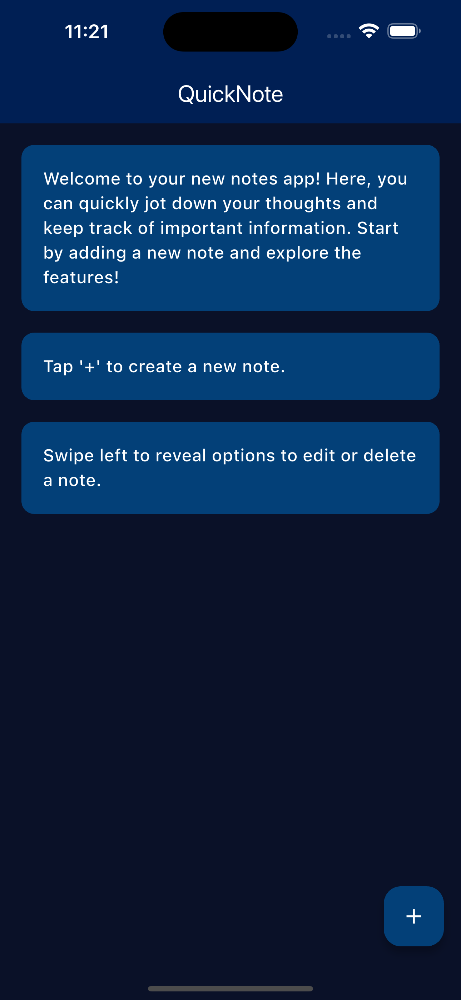
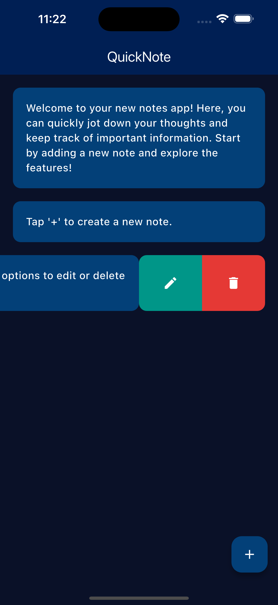
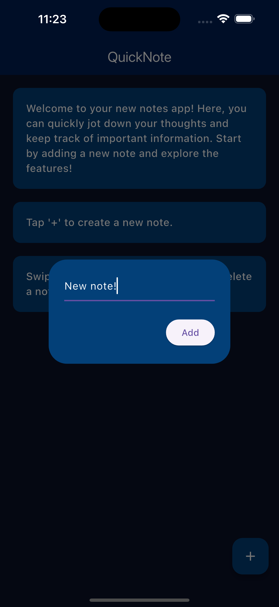

# QuickNote

**QuickNote** is a Flutter application designed for efficient note-taking, leveraging Firestore for CRUD (Create, Read, Update, Delete) operations. This app features a modern UI, slidable tiles for editing and deleting notes, and a floating button for creating new notes. It's crafted to provide a seamless and intuitive note-taking experience.

## Features

- **CRUD Operations**: Perform create, read, update, and delete operations with Firestore.
- **Modern UI**: A sleek and user-friendly interface that enhances the note-taking experience.
- **Slidable Tiles**: Easily edit or delete notes with slidable tiles for quick actions.
- **Floating Action Button**: Create new notes effortlessly with a floating '+' button.
- **Real-Time Updates**: Automatically sync and display changes in real-time using Firestore.

## Screenshots

  
  
  

## Dependencies

- [Flutter](https://flutter.dev/) - A framework for building natively compiled applications for mobile, web, and desktop from a single codebase.
- [firebase_core](https://pub.dev/packages/firebase_core) - Core package required for Firebase integration.
- [cloud_firestore](https://pub.dev/packages/cloud_firestore) - Firestore package for performing CRUD operations.
- [flutter_slidable](https://pub.dev/packages/flutter_slidable) - Adds swipe-to-dismiss functionality to list items.

## How It Works

The app uses Firestore to manage notes, allowing users to create, view, update, and delete notes in real-time. The modern UI design ensures a pleasant user experience, with slidable tiles enabling quick edits and deletions. The floating action button provides an intuitive way to add new notes.

## Contributing

Contributions are welcome! If you have suggestions or improvements, feel free to open an issue or submit a pull request.